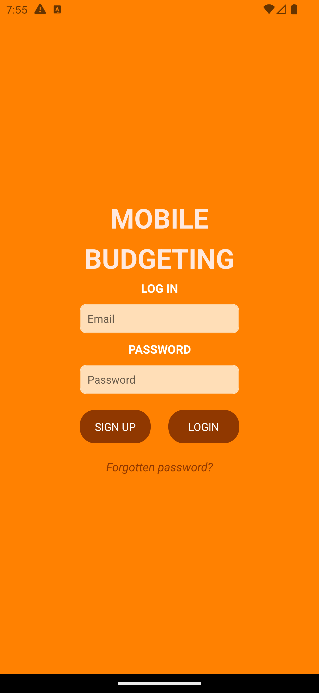

# :moneybag: Mobile Budgeting App :moneybag:

## Description
The Mobile Budgeting App takes mobile budgeting to the next level. Users can create and monitor their own transactions and goals, and intricate data visualisations based on these entries are calculated and shown. View real-time financial news updates, receive financial feedback with our AI Chatbot, and see advice filtered on relevance by a users personal settings.

## How to Build the Project
### Installations
Our project uses numerous packages that require installation:
- x
- x
- x
These packages can also be found in the package.json and package-lock.json files. In the project folder, run the command 'npm install'.

## Build
To access our app, use the Expo Go application on an Android mobile device/emulator. The emulator that some members of our team used during development and testing is Android Studios Virtual Device Manager. In the project folder, run the command 'npm start' and follow the given steps to open the app on your chosen device.

## Usage
There are 8 main pages for you to navigate in our app:

### 1. Log-in

  

The app begins on the Log-in page. The can fill in the account related entry prompts and press the 'log in' button to access the app. If the user doesn't have an account, there's a 'sign up' button that can navigate the user to the Sign-up page. 

### 2. Sign-up

  

The user is prompted to enter an email address and two matching passwords on the Sign-up page. To sign up to the app and log in with the given input, the user can press the 'sign up' button. If the email address or passwords are deemed invalid (null or too short in length), an error message will be displayed and no navigation occurs. If the user doesn't want to continue the signing up process, there is a 'go back' button to take the user back to the log in page.

### 3. Home
The home page displays several buttons that when pressed, show the user the specified graph based on their income, spending, and goals. The graphs are:
* Current Balance
* Monthly Spending
* Monthly Income
* Profit and Loss
* Goal Bars

### 4. Profile
Users can view their set and change their email, password, student status, primary location, transport means, and goal notifications. If the user changes the values of the previously stated attributes and wants to keep them, there's a 'save' button that can be pressed to validate the entry and save it. There's also a 'log out' button on the profile page.

### 5. Advice
The advice page shows local deals regarding grocery prices, entertainment deals, student deals, and fuel deals, dependent on a users profile settings. A map showing nearby deals can be accessed via the 'map' button. The user is also able to interact with an AI Chatbot on this advice page, intending to ask for financial advice. 

### 6. News
Financial articles are displayed and updated on the news page. To filter recent news based on a search query, the user can use the search bar at the top of the screen. If a user wants to read more about a featured article, the article is clickable and takes the user to its source.

### 7. Log
Users can add, track, edit, and delete their transactions on the log page. The 'new transaction' button at the top of the page takes the user to a modal to input a new transactions details and save it to the log. Within the log, transactions are ordered chronologically, with recent transactions being at the top. To delete a transaction, the user can press the bin emoticon next to their desired transaction. To edit a transaction, the user can press the transaction.

### 8. Goals
Users can add, track, edit, and delete their goals on the goals page. The 'new goal' button at the top of the page takes the user to a modal to input a new goals details and save it to the goals log. Within the log, goals are ordered chronologically, with sooner due goals being at the top. To delete a goal, the user can press the bin emoticon next to their desired goal. To edit a goal, the user can press the entry in the log.

## Authors
Auckland University of Technology COMP602/ENSE601 Students:
- Scrum Master: Srushti Madaiah Basavaraju @Sru03 :woman_technologist:
- Product Owner: Jasmine Amohia @jasmimi :woman_technologist:
- Developer: Mark Soluiman @MarkSoluiman :man_technologist:
- Developer: Shambhavi Bhadauria @Shamy152 :woman_technologist: